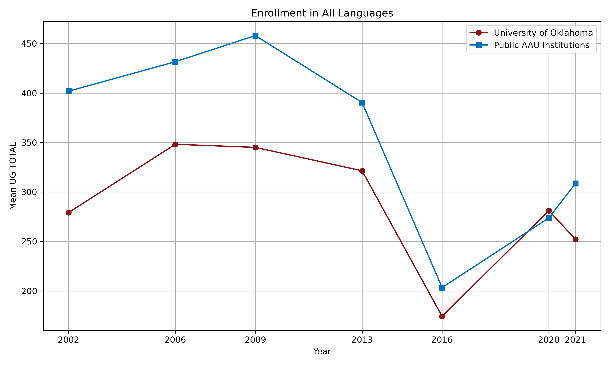
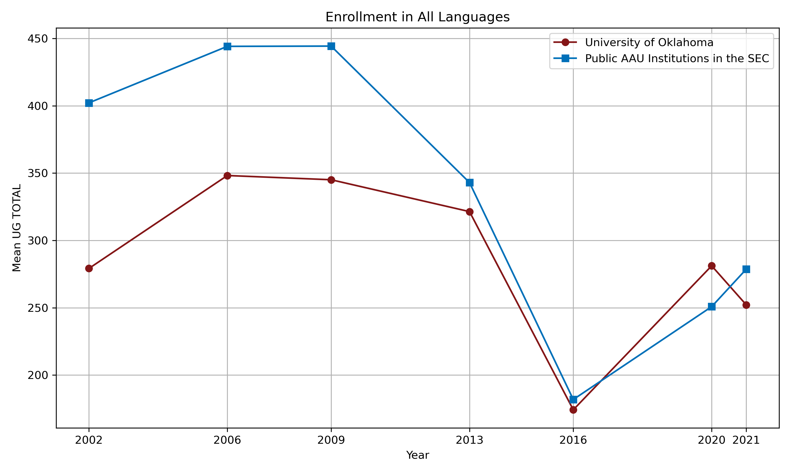

## Purpose

The purpose of this repository is to analyze data collected by the [Modern Language Association](https://www.mla.org/) on foreign language enrollments for the past two decades, with a view to comparing the [University of Oklahoma](https://ou.edu/) to [public institutions that are members](https://www.aau.edu/who-we-are/our-members/aau-member-universities-year-entry) of the [Association of American Universities](https://www.aau.edu/).

## Data

The primary source of data for this analysis is the MLA's [Language Enrollment Database, 1958–2021](https://apps.mla.org/flsurvey_search), which is downloadable at <https://www.mla.org/content/download/191323/file/Historical-language-enrollments-1958-2021.xlsx>.

I am using the [Pandas](https://pandas.pydata.org/) library for Python to analyze the data. My code is openly available in the Jupyter notebooks in the `python` directory in this distributed version control repository.

## Languages

The languages under consideration here are those taught in the departments of the [Dodge Family College of Arts and Sciences](https://ou.edu/cas) at the University of Oklahoma listed alphabetically here:

- [Classics and Letters](https://ou.edu/cas/classicsandletters/) (C&L)
- [Modern Languages, Literatures, and Linguistics](https://ou.edu/cas/modlang/) (MLL)
- [Native American Studies](https://ou.edu/cas/nas/) (NAS)

### C&L

- Ancient Greek
- Latin

### MLLL

- Arabic
- Chinese
- French
- German
- Hebrew
- Italian
- Japanese
- Portuguese
- Russian
- Spanish

### NAS

- Cherokee
- Choctaw
- Creek
- Kiowa
- Potawatomi^[OU data on Potawatomi is not available in the MLA database.]

## Analysis

In most cases, the majority of the top ten institutions in total undergraduate enrollment in each language in 2021 had a foreign language requirement. The exceptions are the Native American languages; since fewer than ten institutions offer them.

| LANGUAGE        |  # OF TOP 10 INSTS WITH A FOREIGN LANGUAGE REQUIREMENT |
|-----------------|--------------------------------------------------------|
| GREEK, ANCIENT  |  5                                                     |
| LATIN           |  7                                                     |
| ARABIC          |  6                                                     |
| CHINESE         |  5                                                     |
| FRENCH          |  7                                                     |
| GERMAN          |  6                                                     |
| HEBREW, MODERN  |  5                                                     |
| ITALIAN         |  8                                                     |
| JAPANESE        |  8                                                     |
| PORTUGUESE      |  7                                                     |
| RUSSIAN         |  8                                                     |
| SPANISH         |  7                                                     |
| CHEROKEE        |  2                                                     |
| CHOCTAW         |  1                                                     |
| KIOWA           |  1                                                     |

### OU's Rankings

OU was in the top 10 in total undergraduate enrollment in Latin, Spanish, Cherokee, Choctaw, and Kiowa in 2021. In nearly every other language it was ahead of at least 10 public AAU institutions. In many cases, OU outranked more than a third of public AAU institutions in total undergraduate enrollment. The exception was Chinese, in which OU outranked three public AAU institutions.

| LANGUAGE        |  OU RANK |
|-----------------|----------|
| GREEK, ANCIENT  |  22      |
| LATIN           |  10      |
| ARABIC          |  24      |
| CHINESE         |  35      |
| FRENCH          |  28      |
| GERMAN          |  19      |
| HEBREW, MODERN  |  15      |
| ITALIAN         |  16      |
| JAPANESE        |  24      |
| PORTUGUESE      |  27      |
| RUSSIAN         |  26      |
| SPANISH         |  10      |
| CHEROKEE        |  1       |
| CHOCTAW         |  1       |
| KIOWA           |  1       |

Compared to the average total undergraduate enrollment in languages at all public AAU institutions, OU had higher numbers in six of the fifteen languages under consideration here in 2021. It was competitive in several others.

| LANGUAGE        |  OU TOTAL |  AAU AVERAGE |
|-----------------|-----------|--------------|
| GREEK, ANCIENT  |  19       |  27.06       |
| LATIN           |  113      |  83.19       |
| ARABIC          |  66       |  94.43       |
| CHINESE         |  113      |  222.21      |
| FRENCH          |  320      |  492.61      |
| GERMAN          |  228      |  256.66      |
| HEBREW, MODERN  |  28       |  33.31       |
| ITALIAN         |  205      |  185.14      |
| JAPANESE        |  234      |  319.39      |
| PORTUGUESE      |  21       |  57.24       |
| RUSSIAN         |  75       |  106.41      |
| SPANISH         |  2020     |  1665.08     |
| CHEROKEE        |  126      |  10.5        |
| CHOCTAW         |  109      |  0           |
| KIOWA           |  105      |  0           |

Here is a chart comparing OU's total undergraduate enrollment in all languages to the average total undergraduate enrollment at all public AAU institutions, up to 2021:

### Comparing OU to public AAU institutions in the SEC

OU had higher enrollments than the average of all public AAU institutions in the SEC in nine of the fifteen languages under consideration here:

| LANGUAGE        |  OU    |  SEC PUBLIC AAUs   |
|-----------------|--------|--------------------|
| GREEK, ANCIENT  |  19    |  40.0              |
| LATIN           |  113   |  86.5              |
| ARABIC          |  66    |  92.5              |
| CHINESE         |  113   |  146.5             |
| FRENCH          |  320   |  445.5             |
| GERMAN          |  228   |  184.25            |
| HEBREW, MODERN  |  28    |  26.5              |
| ITALIAN         |  205   |  113.0             |
| JAPANESE        |  234   |  225.75            |
| PORTUGUESE      |  21    |  67.33             |
| RUSSIAN         |  75    |  96.25             |
| SPANISH         |  2020  |  1740.25           |
| CHEROKEE        |  126   |  0                 |
| CHOCTAW         |  109   |  0                 |
| KIOWA           |  105   |  0                 |

Here is a chart comparing OU's total undergraduate enrollment in all languages to the average total undergraduate enrollment at all public AAU institutions in the SEC, up to 2021:

## Conclusion

It should be noted that twenty of the thirty-eight public AAU institutions have a foreign language requirement. It should also be noted that there is an even split among public AAU institutions that are also in the SEC with regard to a foreign language requirement. The University of Texas, Austin, and the University of Florida have an undergraduate foreign language requirement; Texas A&M and the University of Missouri, Columbia, do not have an undergraduate foreign language requirement.

OU's enrollment, both in individual languages and in total enrollment, tracks closely with the average enrollments in foreign language courses at public AAU institutions. There is a difference of about 100 students from 2002 to 2013, when the enrollment figures at public AAU institutions declined swiftly, continuing to decrease until it hits its nadir in 2016. OU's enrollment had a similar decline, leading me to suspect that something changed in the way the MLA collected data that year. Enrollments begin to increase after 2016, though OU and the public AAU institutions diverged in 2021, for some reason (perhaps the effect of the pandemic?).

In the year 2021—the last year for which the MLA has data—OU was competitive in total undergraduate enrollment, breaking into the top 10 in some languages and performing well in all others except Chinese.

Finally, the data show clearly that OU stands far apart from all public AAU institutions in offering Native American languages.